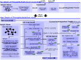

# Knowledge Graph of Thoughts (KGoT)

<div align="center">

**[Architecture Overview](#architecture-overview)** |
**[Setup Guide](#setup-guide)** |
**[Quick Start](#quick-start)** |
**[Citations](#citations)**
</div>

<p align="center">
  
</p>

This is the official implementation of [Affordable AI Assistants with Knowledge Graph of Thoughts](http://arxiv.org/abs/2504.02670).

Knowledge Graph of Thoughts (KGoT) is an innovative AI assistant architecture that integrates LLM reasoning with dynamically constructed knowledge graphs (KGs).
KGoT extracts and structures task-relevant knowledge into a dynamic KG representation, iteratively enhanced through external tools such as math solvers, web crawlers, and Python scripts.
Such structured representation of task-relevant knowledge enables low-cost models to solve complex tasks effectively.

## Architecture Overview

The KGoT system is designed as a modular and flexible framework that consists of three main components: the **Controller**, the **Graph Store**, and the **Integrated Tools**, each playing a critical role in the task-solving process.

<p align="center">
  
</p>

- The [Controller](kgot/controller/README.md) component offers fine-grained control over the customizable parameters in the KGoT pipeline and orchestrates the KG-based reasoning procedure.
- The [Graph Store](kgot/knowledge_graph/README.md) component provides a modular interface for supporting various *Knowledge Graph Backends*. We initially support Neo4j and NetworkX.
- The [Integrated Tools](kgot/tools/README.md) component allows for flexible and extensible *Tool Usage* and enables the multi-modal reasoning capabilities of the framework.

## Setup Guide

In order to use this framework, you need to have a working installation of Python 3.10 or newer.

### Installing KGoT

Before running the installation, make sure to activate your Python environment (if any) beforehand.

```bash
git clone https://github.com/spcl/knowledge-graph-of-thoughts.git
cd knowledge-graph-of-thoughts/
pip install -e .
playwright install
```

### Configuring API Keys and Models

To get started make a copy of the following template files inside the `kgot` directory:

- `kgot/config_llms.template.json`
- `kgot/config_tools.template.json`

Then rename them as follows:

- `config_llms.template.json` → `config_llms.json`
- `config_tools.template.json` → `config_tools.json`

Please update the API keys, if necessary, for the language models you intend to use in the [`kgot/config_llms.json`](kgot/config_llms.json) file.
You can also add new models by incorporating their information into the JSON file.
The object key is the language model identifier used in KGoT, and the various attributes contain the information needed to run the model.

Local models are expected to be hosted using **[Ollama](https://ollama.com/)**. KGoT assumes that the model is accessible at the default Ollama API endpoint (`http://localhost:11434`) and integrates with it through **ChatOllama** via the [LangChain](https://www.langchain.com/) framework.

> [!NOTE]
> **Please be aware** that the values for `num_ctx`, `num_predict`, and `num_batch` in the configuration are based on the specific GPU type and VRAM capacity used during our experiments. You may need to adjust these parameters based on your own hardware setup to avoid out-of-memory errors or suboptimal performance.

For the `SurferAgent` tool we rely on SerpAPI for browsing necessary external information from the Internet.
To use this tool, please set the API key within the [`kgot/config_tools.json`](kgot/config_tools.json) file.

### Setting Up the Containerized Environment

In order to provide a secure & consistent execution environment, we containerize critical modules such as the **Neo4j graph database** and the **Python Code Tool**. This allows the safe execution of LLM-generated code without security concerns.

#### Running the Docker Instances

```bash
cd docker_instances/
chmod -R 777 neo4j_docker/snapshots # grant permission for snapshots logging
docker compose --env-file neo4j_docker/.env up
```

> [!NOTE]
> Further instructions on customizing the Docker images can be found under [Docker Image Setup](docker_instances/README.md).

> [!WARNING]
> The initial building phase can take a while (15 minutes), so be patient.
> If you need to make adjustments simply stop the instances and restart them with the following command `docker compose --env-file docker_instances/neo4j_docker/.env up --build`
> Changes to `README.md`, `LICENSE`, `pyproject.toml`, `kgot/__init__.py` and `kgot/__main__.py` will cause the Docker instances to be rebuilt from scratch.

## Quick Start

We primarily evaluated the Knowledge Graph of Thoughts framework with the GAIA benchmark, which we discuss first and subsequently alternative ways to run KGoT.

### Installing GAIA Dataset

To avoid sharing the GAIA dataset in a crawlable format, we do not directly provide the dataset inside the repository. Instead, we offer a download script to help you acquire the dataset.
Please refer to the [installation guide](GAIA/dataset/README.md) inside the `GAIA` directory for further instructions.

#### Evaluating KGoT on the GAIA Dataset

We provide a run script for evaluating KGoT on the GAIA dataset.

```bash
chmod +x ./run_multiple_gaia.sh # grant permission for logging etc.
./run_multiple_gaia.sh          # perform the actual run with default parameters
```

You can run `./run_multiple_gaia.sh --help` to check the supported arguments, that generally match the options found [here](GAIA/README.md#evaluate-kgot-on-gaia) for the `gaia.py` Python script.
For optimal results, we recommend enabling the '--gaia_formatter' option, which will format the output in a GAIA-compatible format.

The following are the most commonly used arguments:

```
Arguments:
  --log_base_folder     - Directory where logs will be stored [path/to/log_folder]
  --controller_choice   - Type of solver to use               [directRetrieve/queryRetrieve]
  --backend_choice      - Backend database type               [neo4j/networkX]
  --tool_choice         - Tool configuration                  [tools_v2_3]
  --max_iterations      - Max iterations for KGoT             [integers > 0]
  --gaia_formatter      - Use GAIA formatter for the output   [True/False]

Example: ./run_multiple_gaia.sh --log_base_folder logs/test_1 --controller_choice directRetrieve --backend_choice networkX --tools "tools_v2_3" --max_iterations 5 --gaia_formatter
```

We offer two choices for storing the [knowledge graph](kgot/knowledge_graph/README.md) (Neo4j and NetworkX) as well as for the [retrieval type](kgot/controller#knowledge-extraction) (direct and query-based retrevial).

### Using Knowledge Graph of Thoughts

We offer two ways to evaluate KGoT on the GAIA dataset as well as a way to use KGoT directly with any task description.

As discussed above, you can use the `run_multiple_gaia.sh` script to evaluate KGoT on the GAIA dataset, which acts as a frontend for the `gaia.py` Python script.
It allows to evaluate multiple subsets of the GAIA datasets or to do multiple runs on these subsets, while also transfering the knowledge graph snapshots as well as plotting the results with various metrics.
We further discuss the use of the script [here](GAIA#evaluating-multiple-subsets).
Please note, that if you use your own Neo4j server instead of the one inside the Docker container, the transfer of the knowledge graph snapshots will fail or needs to be adapted.

You can also directly run the Python script [gaia.py](GAIA/gaia.py), which we further discuss [here](GAIA#evaluate-kgot-on-gaia).
This Python script will however not plot the resulting data nor move the snapshots of the knowledge graph.

You can also directly use the command `kgot`, which is fully configurable and can be used to solve a single task:

```bash
kgot single -p "What is a knowledge graph?"
```

You can also, for example, select a desirable backend and pass files via the command line:

```bash
kgot --db_choice neo4j --controller_choice directRetrieve single --p "Could you summarize the content of these files for me?" --files [path/to/file1] [path/to/file2]
```

## Citations

If you find this repository useful, please consider giving it a star! If you have any questions or feedback, don't hesitate to reach out and open an issue.

When using this in your work, please reference us with the citation provided below:

```bibtex
@misc{besta2025kgot,
  title = {{Affordable AI Assistants with Knowledge Graph of Thoughts}},
  author = {Besta, Maciej and Paleari, Lorenzo and Hao, Jia and Jiang, Andrea and Gerstenberger, Robert and Wu, You and Iff, Patrick and Kubicek, Ales and Nyczyk, Piotr and Khimey, Diana and Hannesson, Jón Gunnar and Kwaśniewski, Grzegorz and Copik, Marcin and Niewiadomski, Hubert and Hoefler, Torsten},
  year = 2025,
  month = Apr,
  doi = {10.48550/arXiv.2504.02670},
  url = {http://arxiv.org/abs/2504.02670},
  eprinttype = {arXiv},
  eprint = {2504.02670}
}
```
