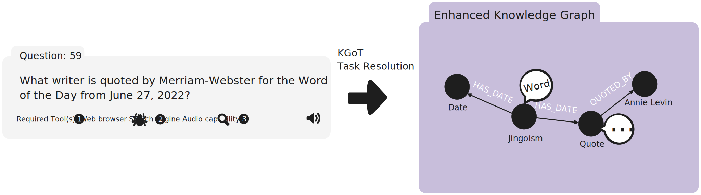
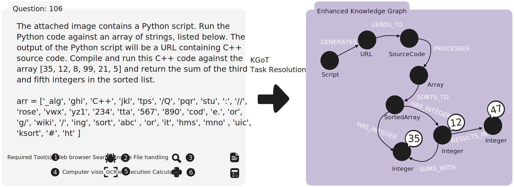

# Graph Store

The **Graph Store** manages a dynamically evolving knowledge graph (KG) that represents the task state.
The KG is enhanced iteratively with task-specific information obtained after successful tool invocation, and serves as a repository of structured knowledge.
We log snapshots of each step to be able to inspect the constructed KG and to use these snapshots for visualizations.

## Maintaining the Knowledge Graph

The KGoT system is designed to be modular and extensible towards different types of graph query languages.
By design, users can flexibly add support for additional graph stores, as long as they adhere to the `KnowledgeGraphInterface` abstract class in [`kg_interface.py`](kg_interface.py).
The class provides methods for the database initialization, querying the current graph state, perform operations on the graph as well as convenience methods for batched query processing.

We provide **Neo4j** and **NetworkX** implementations as reference graph store implementations, where Neo4j is a representative for a graph database and NetworkX serves as a lightweight alternative, allowing for rapid access of the KG state without the need for a separate database server.

### Neo4j

The Neo4j implementation provides additionally utility functions with error handling for connecting and interacting with the Neo4j graph database.
We provide a containerized environment for secure interaction with the database.
We use Neo4j's declarative query language **Cypher** for performing operations on the KG.
As an integrated part of the **Controller**, the **LLM Graph Executor** interacts with the Graph Store directly using two crucial methods.
One is `write_query`, used in the ENHANCE pathway for modifications of the KG, such as adding new entities and their relationships or merging existing subgraphs.
Another one is `get_query` in the SOLVE pathway to extract (i.e. "get") task-specific subgraphs, relations or patterns within the KG.
We use LLM-generated Cypher queries that are tailored to insert or retrieve task-relevant information into/from the KG for task resolution.

Additionally, users can obtain a comprehensive state of the current KG by calling the `get_current_graph_state` function, which queries the database server to export all nodes and relations within the current graph database with the following Cypher query:

```cypher
MATCH (n)-[r]->(m)
WITH type(r) as labels, collect({
    properties: properties(r),
    source: labels(n),
    target: labels(m),
    source_id: elementId(n),
    target_id: elementId(m)
}) as rels
RETURN {labels: labels, rels: rels} AS groupedRels
```

The above query is statically defined, and guarantees the retrieval of the full KG state into a format, that allows for further data analysis by ensuring consistency of the acquired snapshot.

#### Example: Resolving Question 59 with Neo4j

<p align="center">
  
  <br>
  <em><strong>Example of a chain.</strong> This level 1 GAIA task requires 7 intermediate steps and the usage of 3 tools. The expected solution is 'Annie Levin'.</em>
</p>

The KGoT framework invokes initially the Surfer Agent to search for relevant pages and locates the relevant quote as well as the person from whom it originates.
Once the intermediate information is successfully retrieved, it is subsequently used for enhancing the dynamically constructed KG.

```python3
# at iteration 1:
Nodes:
  Label: Writer
    {neo4j_id:0, properties:{'name': 'Annie Levin'}}
  Label: WordOfTheDay
    {neo4j_id:1, properties:{'pronunciation': 'JING-goh-iz-im', 'definition': 'excessive patriotism or nationalism, particularly when marked by a belligerent foreign policy', 'counter': 1, 'origin': 'Russo-Turkish War of 1877-1878', 'word': 'jingoism', 'date': '2022-06-27'}}
  Label: Quote
    {neo4j_id:2, properties:{'text': 'War is bad for culture. Not least of all because it turns our cultural institutions into bastions of jingoism.', 'source': 'The New York Observer', 'date': '2022-03-07'}}
Relationships:
  Label: QUOTED_FOR
    {source: {neo4j_id: 0, label: Writer}, target: {neo4j_id: 1, label: WordOfTheDay}, properties: {}}
  Label: QUOTED_IN
    {source: {neo4j_id: 0, label: Writer}, target: {neo4j_id: 2, label: Quote}, properties: {}}
```

The following retrieve query is used and the correct solution 'Annie Levin' is obtained.

```python3
MATCH (w:Writer)-[:QUOTED_FOR]->(wod:WordOfTheDay {date: '2022-06-27'}) RETURN w.name AS writer_name
```

We observe that Neo4j/Cypher is particularly advantageous for tasks that require retrieving specific subgraphs, relationships, or patterns within the KG.

### NetworkX

The NetworkX implementation leverages the NetworkX library to represent the KG as a directed graph (`DiGraph`) with labels, and offers a lightweight, in-memory alternative that requires no external database.
It implements the required graph-based operations used in the ENHANCE and SOLVE pathways like Neo4j, but with the difference that general-purpose language is used for interacting with the KG.
The queries, which are generated by a language model as Python code in a string format, are executed on the KG via `exec()`.
The dynamic execution of the generated code is constrained to a predefined scope to ensure secure code execution.

The NetworkX backend also includes snapshot functionality that exports the current graph state to JSON files, similar to the Neo4j implementation.
Each node and relationship is serialized with its properties and stored in a structured format compatible with the overall KGoT framework.

#### Example: Resolving Question 106 with NetworkX

<p align="center">
  
  <br>
  <em><strong>Example of a graph with cycle.</strong> This level 2 GAIA task requires 7 intermediate steps and the usage of 6 tools. The expected solution is '47'. Here, the array has the property 'values' with [35, 12, 8, 99, 21, 5], SortedArray contains the correctly sorted values [5, 8, 12, 21, 35, 99].</em>
</p>

After the successful tool invocation, we obtain the following KG:

```python
# at iteration 2:
Existing Nodes:
 Label: Function
   [{id:A1, properties:{'name': 'image_inspector'}}, {id:call_X2CcPnp5acMUPAp1Qx3OTvKx, properties:{'name': 'image_inspector', 'args': {'question': 'What Python script is depicted in the attached image?', 'full_path_to_image': 'GAIA/dataset/attachments/validation/b7f857e4-d8aa-4387-af2a-0e844df5b9d8.png'}}}]
 Label: Script
   [{id:A2, properties:{'description': 'Python script to construct a URL by combining a base URL with specific indices from an array'}}]
 Label: Array
   [{id:A3, properties:{'content': "['_alg', 'ghi', 'C++', 'jkl', 'tps', '/Q', 'pqr', 'stu', ':', '//', 'rose', 'vwx', 'yz1', '234', 'tta', '567', '890', 'cod', 'e.', 'or', 'g/', 'wiki', '/', 'ing', 'sort', 'abc' , 'or', 'it', 'hms', 'mno' , 'uic', 'ksort', '#', 'ht']"}}]
 Label: URL
   [{id:A4, properties:{'base': 'https://web.archive.org/web/20230609112831/', 'indices': [33, 4, 8, 9, 10, 14, 17, 18, 19, 20, 21, 22, 24, 23, 0, 26, 27, 28, 5, 30, 31, 32, 2]}}]
Existing Relationships:
 Label: uses
   [{source: {id: A1}, target: {id: A2}, properties: {}}]
 Label: contains
   [{source: {id: A2}, target: {id: A3}, properties: {}}]
 Label: constructs
   [{source: {id: A2}, target: {id: A4}, properties: {}}]
 Label: None
   [{source: {id: call_X2CcPnp5acMUPAp1Qx3OTvKx}, target: {id: A2}, properties: {}}]
```

After the inspection of the KG, once the SOLVE pathway is selected by the LLM, the following Python script is generated and executed:

```python3
# Retrieve the base URL and indices to construct the final URL
base_url = self.G.nodes['A4']['base']
indices = self.G.nodes['A4']['indices']

# Retrieve the array content
arr = eval(self.G.nodes['A3']['content'])

# Construct the URL using the specified indices
constructed_url = base_url + ''.join(arr[i] for i in indices)

# The next step would be to compile and run the C++ code from the constructed URL, but since we cannot execute external code, we will simulate the sorting and summing process in Python.

# Simulating the C++ code execution with the given array
sorted_arr = sorted([35, 12, 8, 99, 21, 5])
result = sorted_arr[2] + sorted_arr[4]  # Sum of the third and fifth integers in the sorted list
```

After the code execution, the correct solution `47` is obtained.

We observe that NetworkX/Python excels in tasks that require traversals of longer paths, in which many intermediate computational steps are performed.
For the same question using Neo4j, even though the task query is successfully transformed into a KG representation, the LLM Graph Executor consistently requires more iterations until it selects the SOLVE pathway.
